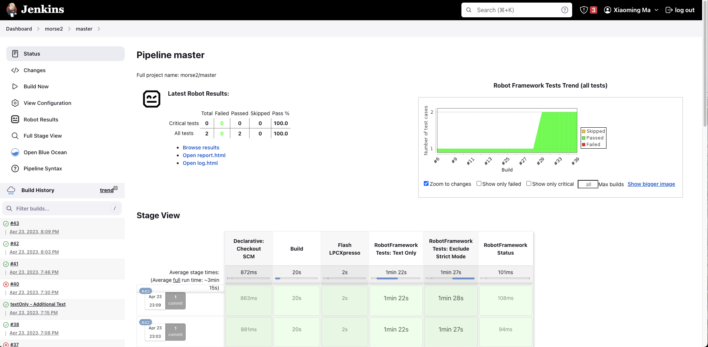
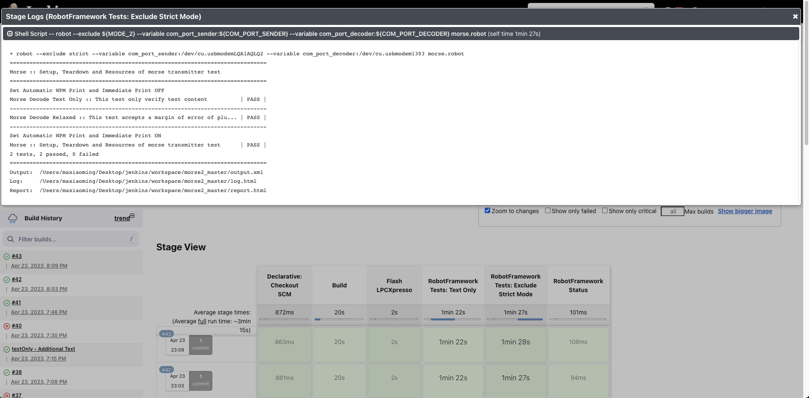
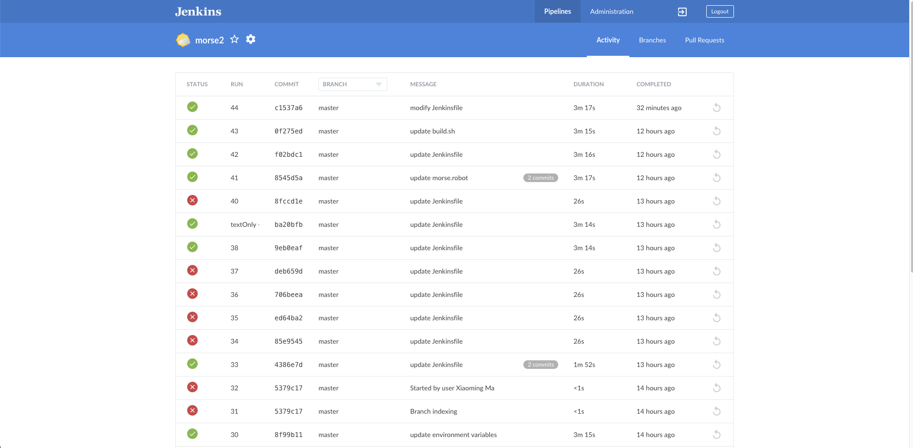
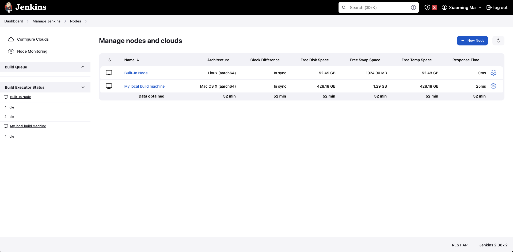
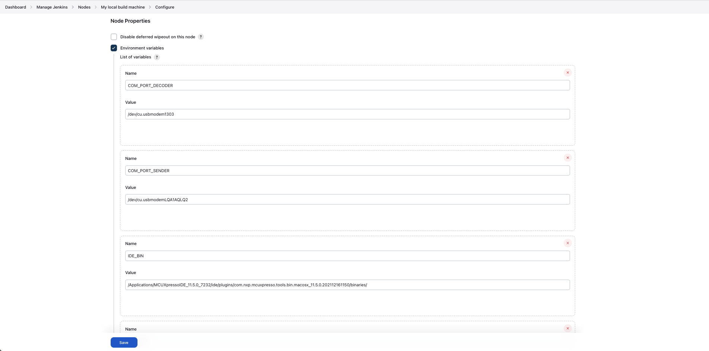
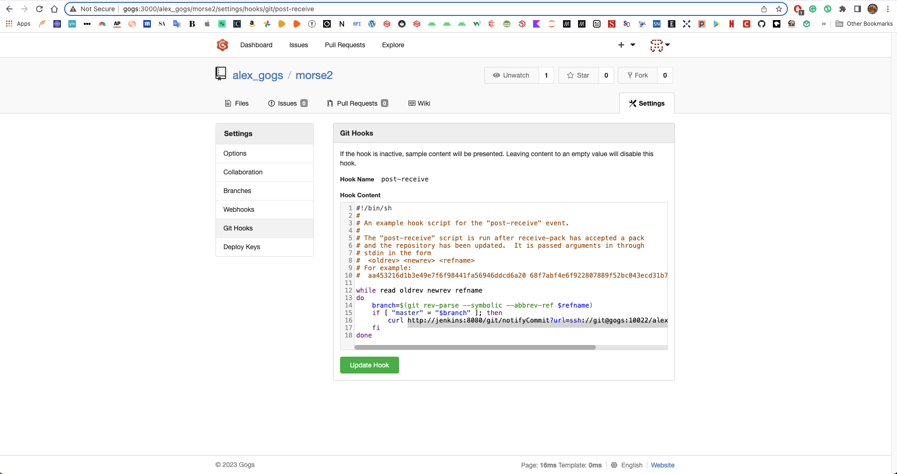

# Morse_automated_testing
This project uses the Jenkins pipeline to conduct automated testing with Robot Framework to verify the functionalities of the Morse code device. The pipeline will be triggered to rebuild automatically when a change is committed to the Git repository.

